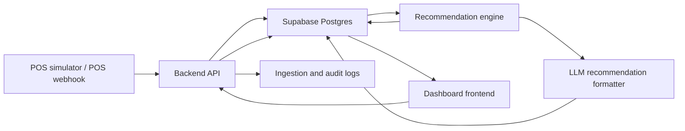

# Architecture

## Objetivo arquitectónico

La arquitectura inicial debe permitir una demo end-to-end sin acoplar el producto a una ticketera específica. El sistema debe aceptar transacciones simuladas o reales, persistirlas, calcular KPIs con lógica propia y generar recomendaciones explicables.

## Componentes

### POS simulator o webhook POS

En V1 se usará un simulador POS para reproducir ventas históricas o mock transactions. El contrato debe parecerse a un webhook real para facilitar integraciones futuras.

Responsabilidades:

- Generar ventas por evento, barra, producto y timestamp.
- Enviar transacciones al endpoint de ingesta.
- Permitir replay acelerado de un evento.
- Marcar claramente datos simulados.

### API backend

Capa de entrada para POS, dashboard y recomendaciones.

Responsabilidades:

- Validar payloads.
- Persistir transacciones.
- Manejar errores de ingesta.
- Exponer datos agregados al frontend.
- Ejecutar recommendation runs.
- Registrar auditoría de acciones.

### Supabase

Base de datos principal del MVP.

Responsabilidades:

- Guardar organizaciones, usuarios, eventos, barras, productos e inventario.
- Persistir transacciones y líneas de transacción.
- Guardar recommendation runs, recommendations, offers y logs.
- Aplicar RLS por organización y rol.

### Recommendation engine

Motor de negocio explicable.

Responsabilidades:

- Calcular ventas por hora, margen por SKU, sell-through, stock restante y riesgo de sobrante.
- Evaluar reglas de oportunidad.
- Generar recomendaciones estructuradas con evidencia.
- Evitar decisiones si faltan datos críticos.

### LLM recommendation formatter

Capa de lenguaje controlada.

Responsabilidades:

- Recibir una recomendación estructurada ya calculada.
- Convertirla en texto claro, breve y accionable.
- Mantener formato consistente.
- No inventar métricas, montos ni resultados.

### Dashboard frontend

Interfaz táctica para usuarios de negocio y operación.

Responsabilidades:

- Mostrar KPIs del evento.
- Mostrar recomendaciones activas.
- Permitir aplicar o descartar recomendaciones.
- Exponer evidencia y estado.
- Diferenciar datos reales, simulados y supuestos.

### Logs y manejo de errores

El sistema debe registrar:

- Payloads POS recibidos y resultado de validación.
- Errores de persistencia.
- Recommendation runs y reglas disparadas.
- Llamadas LLM con versión de prompt, sin guardar secretos.
- Acciones del usuario sobre recomendaciones.

## Diagrama

## Flujo de datos principal

1. POS simulator envía una transacción.
2. API valida organización, evento, barra, productos, cantidades y montos.
3. API guarda `transactions` y `transaction_items`.
4. API actualiza o permite calcular inventario vendido.
5. Recommendation engine corre manualmente o por intervalo.
6. Engine crea `recommendation_runs` y `recommendations`.
7. LLM formatter genera una versión legible de la recomendación.
8. Dashboard consume KPIs y recomendaciones.
9. Usuario aplica o descarta.
10. API registra auditoría.

## Decisiones iniciales

- No inicializar Next.js todavía.
- No crear schema SQL definitivo todavía.
- Mantener contratos preliminares en Markdown.
- Diseñar endpoints como si luego pudieran implementarse en Next.js API routes, Supabase Edge Functions o un backend Node separado.
- Priorizar trazabilidad sobre automatización compleja.

